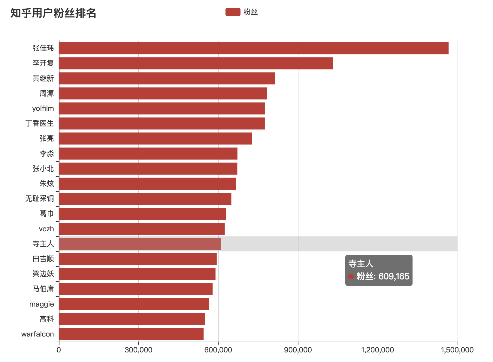

## 知乎用户数据可视化

#### 项目说明
主要是针对之前[爬虫](https://github.com/qshine/Zhihu)跑的一批知乎数据进行可视化, 刚好计划学习tornado和Celery, 所以就使用这两个来做了.

- tornado: 后端(没有使用异步库) 提供数据接口
- MySQL: 数据库, 使用原生SQL
- Redis: 缓存
- Celery
    - 定时任务: 定时刷新粉丝排名前20的用户信息, 可以看粉丝, 回答数等信息的增量
    - 异步任务: 用户搜索时调用该接口, 防止爬虫阻塞进程
- ECharts: 数据可视化

#### 结果展示



#### 运行步骤
1. 创建环境
```
conda create --name CrawlerChart python=3.5
source activate CrawlerChart
pip install -r requirements.txt
```
2. 更改`config.py`数据库配置
3. 启动
```
ipython run.py
celery -B -A tasks worker -l info
```


